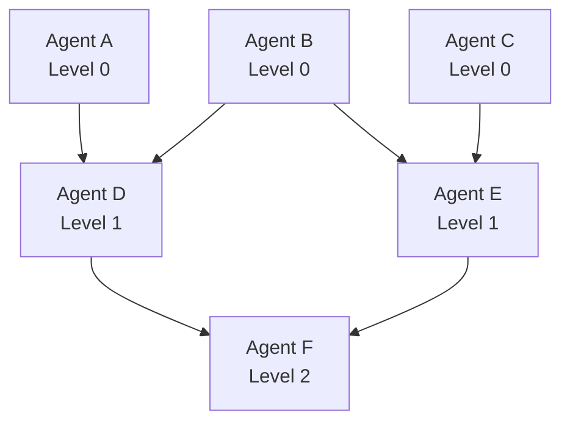

# [Command Name]

**Version**: 2.0 (Orchestration Optimized)
**Estimated Time**: [X-Y minutes] (improved from [original time])
**Pattern**: [DAG Pattern Type - e.g., Parallel Analysis, Sequential Pipeline, Fan-out/Fan-in]

---

## Purpose

[Brief description of what this command does]

## Multi-Agent Coordination Strategy

Uses **[pattern name]** where [brief explanation of coordination approach].

### [Command] Architecture
```
┌──────────────────────────────────────────────────┐
│         [Main Orchestrator]                       │
│         ([orchestrator-agent])                    │
└────────────┬─────────────────────────────────────┘
             │
    ┌────────┼────────┬────────┬────────┐
    ▼        ▼        ▼        ▼        ▼
 [Agent1] [Agent2] [Agent3] [Agent4] [Agent5]
```

## Execution Flow with TodoWrite

### Initialization
```typescript
// Auto-generate TodoWrite tasks from DAG structure
const todos = [
  {
    content: "Initialize [command name]",
    activeForm: "Initializing [command]",
    status: "in_progress"
  },
  {
    content: "[Task 1 description]",
    activeForm: "[Active form of task 1]",
    status: "pending"
  },
  {
    content: "[Task 2 description]",
    activeForm: "[Active form of task 2]",
    status: "pending"
  },
  // Add more tasks...
];
```

---

### Phase 1: [Phase Name] ([time range])
**TodoWrite Update**: Mark "[phase name]" as in_progress

**DAG Level 0**: [Agents with no dependencies - run in PARALLEL]

1. **[agent-name]** - [What this agent does]
   - [Subtask 1]
   - [Subtask 2]
   - **Input**: [Dependencies, or "None" if Level 0]
   - **Output**: `[output-name]` (cached for reuse)

**TodoWrite Update**: Mark "[task name]" as completed

---

### Phase 2: [Phase Name] ([time range])
**TodoWrite Update**: Mark "[phase name]" as in_progress

**DAG Level 1**: [Agents that depend on Level 0 - run in PARALLEL]

**Note**: All agents in this level run in **PARALLEL** using shared context from Phase 1

#### Stream 1: [Stream Name]
2. **[agent-name]** (Uses cached `[context-name]`)
   - [Subtask 1]
   - [Subtask 2]
   - **Input**: `[dependency from Phase 1]`
   - **Output**: `[output-name]`

**TodoWrite Update**: Mark "[task name]" as completed

#### Stream 2: [Stream Name]
3. **[agent-name]** (Uses cached `[context-name]`)
   - [Subtask 1]
   - [Subtask 2]
   - **Input**: `[dependency from Phase 1]`
   - **Output**: `[output-name]`

**TodoWrite Update**: Mark "[task name]" as completed

[Repeat for all parallel streams...]

---

### Phase 3: [Final Phase - usually synthesis] ([time range])
**TodoWrite Update**: Mark "[final phase]" as in_progress

**DAG Level 2**: [Final aggregation agent]

N. **[final-agent]** - [Aggregation and synthesis]
   - Combine all outputs from Phase 2
   - [Final processing steps]
   - Generate final deliverables
   - **Input**: All outputs from Phase 2
   - **Output**: Final report/results

**TodoWrite Update**: Mark "[final task]" as completed

---

## Agent Coordination Layers

### [Layer 1 Name]
- **[agent-name]**: [Responsibility]
- **[agent-name]**: [Responsibility]

### [Layer 2 Name] (Parallel Execution)
- **[agent-name]**: [Responsibility]
- **[agent-name]**: [Responsibility]
- **[agent-name]**: [Responsibility]

### [Layer 3 Name]
- **[agent-name]**: [Responsibility]

---

## Context Sharing (Performance Optimization)

```typescript
// Phase 1: Create shared context (cache for [duration])
const [contextName] = await [analyzer].analyze();
contextManager.set("[context-key]", [contextName], ttl=[seconds]);

// Phase 2: All agents reuse context ([percentage]% time savings)
const context = await contextManager.get("[context-key]"); // Cache hit!

// No redundant analysis across [N] agents
```

**Benefits**:
- **[X]% reduction** in redundant work
- **Consistent data** across all agents
- **Faster execution** through cache hits

---

## Expected Outputs

### 1. [Output Category 1]
- [Detail 1]
- [Detail 2]
- [Detail 3]

### 2. [Output Category 2]
- [Detail 1]
- [Detail 2]

### 3. [Final Output]
- [Comprehensive report/deliverable]
- [Metrics and measurements]
- [Recommendations]

---

## Success Criteria

- ✅ [Context created and cached]
- ✅ [All parallel streams completed]
- ✅ [Zero redundant analysis]
- ✅ [All TodoWrite tasks marked completed]
- ✅ [Primary deliverable generated]
- ✅ [Quality criteria met]
- ✅ [Execution time under target]

---

## Performance Improvements

### Before (Sequential)
```
Phase 1: [Agent 1] ([time])
Phase 2: [Agent 2] ([time])
Phase 3: [Agent 3] ([time])
Phase N: [Agent N] ([time])
Total: [total sequential time]
```

### After (Parallel with Context Sharing)
```
Level 0: [Shared context creation] ([time]) → context cached

Level 1: [N agents] in Parallel ([max time])
  - [Agent 1] ([original time], with cache: [reduced time])
  - [Agent 2] ([original time], with cache: [reduced time])
  - [Agent N] ([original time], with cache: [reduced time])
  Max time: [longest agent time]

Level 2: [Final synthesis] ([time])

Total: [total parallel time] ([X]% faster!)
```

**Speedup Calculation**:
- Sequential: [original time]
- Parallel: [new time]
- Improvement: **[percentage]% faster**

---

## Usage Examples

### Example 1: [Basic Usage]
```
/[command-name]

Expected Output:
✅ [Task 1] - Completed ([time])
✅ [Task 2] - Completed ([time])
✅ [Task N] - Completed ([time])

Total: [time]
[Summary of results]
```

### Example 2: [Advanced Usage with Options]
```
/[command-name] --option1=value --option2=value

[Description of what this does]
Total: [estimated time]
```

---

## TodoWrite Progress Example

```
During execution, user sees:

[completed] [Task 1] ([time])
[completed] [Task 2] ([time])
[in_progress] [Current task]
  └─ [Subtask 1]...
  └─ [Subtask 2]...
[pending] [Future task]
```

---

## Configuration Options

### [Option Category 1]
- `--[option1]=[value]` - [Description]
- `--[option2]=[value]` - [Description]

### [Option Category 2]
- `--[option3]=[value]` - [Description]
- `--[option4]=[value]` - [Description]

---

## DAG Visualization



**Critical Path**: [A → D → F] = [total time on critical path]
**Parallelism**: [Level 0: 3 parallel, Level 1: 2 parallel]

---

## Failure Recovery (Saga Pattern)

### Compensation Logic
```typescript
// Each agent defines rollback
agent1.compensate = async () => {
  // Undo agent1 actions
};

agent2.compensate = async () => {
  // Undo agent2 actions
};

// On failure: Run compensations in reverse order
if (error) {
  await agent2.compensate();
  await agent1.compensate();
}
```

### Checkpoints
- **Checkpoint 1**: After Level 0 completion
- **Checkpoint 2**: After Level 1 completion
- **Final**: After Level 2 completion

---

## Notes

- **Context Sharing**: [Description of what's cached and TTL]
- **Parallel Execution**: [Which agents run in parallel]
- **TodoWrite Integration**: Automatic progress tracking throughout
- **Performance**: [X]% faster than sequential execution
- **Scalability**: [Scalability notes]
- **Accuracy**: No loss in quality from parallelization

---

## Migration from v1.0

### Changes
1. ✅ Added TodoWrite integration (100% visibility)
2. ✅ Implemented parallel execution ([N] agents in parallel)
3. ✅ Added context sharing ([X]% reduction in redundant work)
4. ✅ Added failure recovery (Saga pattern)
5. ✅ Improved execution time by [X]%

### Backward Compatibility
- Command interface unchanged (same parameters)
- Output format identical
- Migration transparent to users

---

**Version History**:
- **v2.0** ([date]): Orchestration optimization (TodoWrite, parallel execution, context sharing)
- **v1.0** ([date]): Original implementation

---

## Implementation Checklist

When creating a new optimized command:

- [ ] Define DAG structure (levels, dependencies)
- [ ] Identify parallel execution opportunities
- [ ] Define shared context for caching
- [ ] Add TodoWrite task definitions
- [ ] Implement compensation logic (Saga pattern)
- [ ] Add checkpoints for recovery
- [ ] Calculate performance improvements
- [ ] Create usage examples
- [ ] Update documentation
- [ ] Test parallel execution
- [ ] Validate TodoWrite updates
- [ ] Benchmark performance gains
